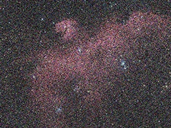
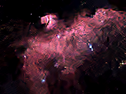

# Astro-Image-Pipeline
A Python-based image processing pipeline for enhancing amateur astrophotography. It improves deep-sky images by combining BM3D denoising, histogram stretching, and unsharp masking.


<div align="center">

[ 🇬🇧 English ](#-english) | [ 🇹🇷 Türkçe ](#-türkçe)

</div>

---

## 🇬🇧 English

# 🌌 Amateur Astronomy - Image Processing Pipeline

This project is a Python-based image processing pipeline developed to overcome the disadvantages of amateur astrophotography, such as urban light pollution and CMOS sensor noise. It is specifically designed to enhance raw stacked images from compact smart telescopes like the Seestar S50, clean the gray background, and highlight celestial objects.

### 🖼️ Before and After

| Original (Gray and Pale) | Sharpened, Clean, and Black Space |
| :---: | :---: |
|  |  |
| *Raw image, gray and noisy due to light pollution.* | *Result after BM3D denoising and black point adjustment.* |

### 🚀 Features and Algorithm Steps

The script performs three main operations sequentially with a single function call:

1. **Denoising with BM3D (Block Matching 3D):**
   Finds similar small blocks in the image, stacks them into a 3D array, and suppresses noise using frequency transformation. It cleans up fine grain while preserving star and nebula edges.
2. **Histogram Stretching & Black Point Adjustment:**
   Fixes the histogram that clusters at low values due to light pollution. It redefines the bottom 15% of brightness (default `black_point = 15`) as true black. Additionally, to prevent core blowout in high dynamic range targets (e.g., the Orion Nebula), the upper percentile is limited to 99.9%.
3. **Unsharp Masking (Sharpening):**
   The image is blurred using the Gaussian algorithm (`sigma = 2.0`) and blended with the original image to sharpen edges. Stars are made more pinpoint, and blooming artifacts are prevented by clipping the values between 0.0 and 1.0.

### 🛠️ Requirements and Installation

You need the following Python libraries to run the project:

```bash
pip install opencv-python numpy matplotlib scikit-image bm3d
```

### 💻 Usage

The main function, `astro_black_point_and_denoise`, offers customizable parameters. You can include it in your project and use it as follows:

```python
from main import astro_black_point_and_denoise

# Basic Usage
astro_black_point_and_denoise(
    input_path="gorsel_1.png", 
    output_path="temiz_uzay_1.png", 
    noise_std=0.10,        # BM3D noise density
    black_point=15,        # Background black point percentile
    sharpen_amount=1.2     # Unsharp Masking coefficient
)
```

**Parameter Tips:**
* **For very noisy images:** You can increase the `noise_std` value to the `0.15 - 0.20` range.
* **Sharpness adjustment:** The default `sharpen_amount` is 1.2. If the image looks too sharp, you can lower it to 0.8, or increase it between 1.5 - 2.0 to make structures even more prominent.

### ⚠️ Limitations

* **Processing Time:** The BM3D algorithm can take a few minutes on high-resolution images depending on processing power.
* **Satellite Trails:** This pipeline does not clean satellite trails; methods like sigma-clipping should be applied during the stacking phase for this.
* **Ringing Artifacts:** Setting the `sharpen_amount` too high (>1.8) can cause black ringing artifacts around bright stars.

### 🔮 Future Plans

The following features are planned to be added to the project in the future:
- Automatic noise estimation from the empty background region.
- Sharper PSF with Richardson-Lucy deconvolution.
- Using a reference star for color calibration.

---

## 🇹🇷 Türkçe

# 🌌 Amatör Astronomi - Görüntü İşleme Pipeline

Bu proje, kentsel ışık kirliliği ve CMOS sensör gürültüsü gibi amatör astrofotografi dezavantajlarını aşmak için geliştirilmiş Python tabanlı bir görüntü işleme ardışık düzenidir (pipeline). Özellikle Seestar S50 gibi kompakt akıllı teleskopların ham yığınlanmış (stacked) görüntülerini iyileştirmek, gri arka planı temizlemek ve gök cisimlerini belirginleştirmek için tasarlanmıştır.

### 🖼️ Öncesi ve Sonrası

| Orijinal (Gri ve Solgun) | Keskinleştirilmiş, Temiz ve Siyah Uzay |
| :---: | :---: |
|  |  |
| *Işık kirliliği nedeniyle grileşmiş ve gürültülü ham görüntü.* | *BM3D ile temizlenmiş, siyah noktası ayarlanmış sonuç.* |

### 🚀 Özellikler ve Algoritma Adımları

Script, tek bir fonksiyon çağrısı ile üç temel işlemi sırasıyla gerçekleştirir:

1. **BM3D ile Gürültü Temizleme (Block Matching 3D):**
   Görüntüdeki benzer küçük blokları bularak üç boyutlu bir diziye yığar ve frekans dönüşümü ile gürültüyü bastırır. İnce kumlanmayı temizlerken yıldız ve nebula kenarlarını korur.
2. **Histogram Germe ve Siyah Nokta (Black Point) Ayarı:**
   Işık kirliliğinden dolayı düşük değerlerde yığılan histogramı düzenler. Parlaklığın alt %15'lik dilimini (varsayılan `black_point = 15`) gerçek siyah olarak yeniden tanımlar. Ayrıca yüksek dinamik aralığa sahip (örn. Orion Nebulası) hedeflerde çekirdek patlamasını önlemek için üst persentil %99.9 olarak sınırlandırılmıştır.
3. **Unsharp Masking (Keskinleştirme):**
   Görüntü Gaussian algoritması ile bulanıklaştırılır (`sigma = 2.0`) ve orijinal görüntü ile ağırlıklı olarak karıştırılarak kenarlar sivriltilir. Yıldızlar daha nokta benzeri hale getirilirken, 0.0-1.0 aralığında kırpılarak (clipping) parlama artefaktları engellenir.

### 🛠️ Gereksinimler ve Kurulum

Projeyi çalıştırmak için aşağıdaki Python kütüphanelerine ihtiyacınız vardır:

```bash
pip install opencv-python numpy matplotlib scikit-image bm3d
```

### 💻 Kullanım

Ana fonksiyon olan `astro_black_point_and_denoise`, özelleştirilebilir parametreler sunar. Projenize dahil edip aşağıdaki gibi kullanabilirsiniz:

```python
from main import astro_black_point_and_denoise

# Temel Kullanım
astro_black_point_and_denoise(
    input_path="gorsel_1.png", 
    output_path="temiz_uzay_1.png", 
    noise_std=0.10,        # BM3D gürültü yoğunluğu
    black_point=15,        # Arka plan siyah nokta persentili
    sharpen_amount=1.2     # Unsharp Masking katsayısı
)
```

**Parametre İpuçları:**
* **Çok gürültülü görsellerde:** `noise_std` değerini `0.15 - 0.20` bandına çıkarabilirsiniz.
* **Keskinlik ayarı:** Varsayılan `sharpen_amount` 1.2'dir. Görüntü çok keskin gelirse 0.8'e düşürebilir veya yapıları daha da belirginleştirmek için 1.5 - 2.0 arasına çıkarabilirsiniz.

### ⚠️ Sınırlandırmalar

* **İşlem Süresi:** BM3D algoritması, yüksek çözünürlüklü görüntülerde işlemci gücüne bağlı olarak birkaç dakika sürebilir.
* **Uydu İzleri:** Bu pipeline uydu izlerini temizlemez; bunun için yığınlama (stacking) aşamasında sigma-clipping gibi yöntemler uygulanmalıdır.
* **Halka Artefaktları:** `sharpen_amount` değerinin çok yüksek (>1.8) tutulması, parlak yıldızların etrafında siyah halkalar (ringing artifact) oluşmasına neden olabilir.

### 🔮 Gelecek Planları

Projeye ilerleyen aşamalarda şu özelliklerin eklenmesi planlanmaktadır:
- Boş arka plan bölgesinden otomatik gürültü tahmini.
- Richardson-Lucy dekonvolüsyonu ile daha keskin PSF elde edilmesi.
- Renk kalibrasyonu için referans yıldızı kullanımı.

---
**Developer / Geliştirici:** Besat Arif Çıngar
```
